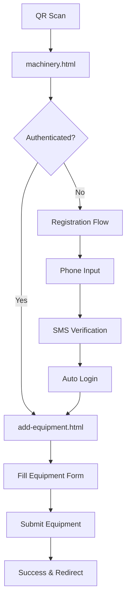

# Stroyka.kz - Equipment Management System

## 📁 Project Structure

```
qrstroyka.kz/
├── index.html                  # Main landing page
├── equipment/                  # Equipment management module
│   ├── machinery.html         # Equipment registration/login page
│   ├── add-equipment.html     # Equipment creation form
│   ├── api.js                 # API service layer
│   └── README.md              # This file
├── logo.jpeg                  # Company logo
├── public/                    # Static assets
└── vercel.json               # Deployment configuration
```

## 🚀 Features

### 1. **Equipment Landing Page** (`machinery.html`)
- **QR Code Entry Point**: Users scan QR and land on this page
- **Language Selection**: Kazakh (default) / Russian
- **App Download Links**: Direct links to iOS/Android apps
- **Registration Flow**: 3-step phone verification process
- **Auto-Redirect**: Authenticated users go directly to equipment form

### 2. **Equipment Registration Form** (`add-equipment.html`)  
- **Complete Equipment Form**: All fields from Flutter `create_equipment_rental_confirm_widget.dart`
- **Searchable Dropdowns**: Categories, subcategories, models with real-time search
- **Photo Upload**: Drag & drop with preview
- **Progress Tracking**: Visual progress bar for required fields
- **Bilingual Interface**: Full Kazakh/Russian support

### 3. **API Service Layer** (`api.js`)
- **Authentication APIs**: Registration, SMS, token management
- **Dictionary APIs**: Categories, subcategories, models with search
- **Equipment Publishing**: Form submission with photo upload
- **Error Handling**: Comprehensive error management
- **Debounced Search**: Performance-optimized search functionality

## 🔗 API Integration

### Authentication Endpoints
- `POST /rest/api/v1/register/auth` - User registration
- `POST /rest/api/v1/register/send` - SMS sending  
- `POST /rest/api/v1/register/auth/activate` - SMS verification
- `POST /oauth2/token` - Token generation

### Dictionary Endpoints
- `GET /api/v1/dictionary/special-machinery?machineryTree=CATEGORY&search=...`
- `GET /api/v1/dictionary/special-machinery?machineryTree=SUB_CATEGORY&parentId=X&search=...`
- `GET /api/v1/dictionary/machinery-models?search=...`

### Equipment Publishing
- `POST /api/v1/equipment` - Publish equipment (placeholder)
- `POST /api/v1/upload` - Photo upload (placeholder)

## 📱 User Flow



## 🛠 Form Fields Structure

### **Required Fields**
- **Category** (спецтехника категориясы) - API dropdown with search
- **Subcategory** (техника түрі) - API dropdown with search  
- **Condition** (жай-күйі) - Button selection
- **Address** (мекенжай) - API dropdown with search

### **Optional Fields**  
- **Model/Brand** (марка) - API dropdown with search
- **Model Extended** (модель) - Text input
- **Year** (шығару жылы) - Dropdown (current year to 1970)
- **Engine Type** (қозғалтқыш түрі) - Static dropdown
- **Steering** (басқару) - Static dropdown  
- **Engine Model** (қозғалтқыш моделі) - Text input
- **Weight** (масса) - Number input
- **Comments** (пікірлер) - Textarea
- **Photos** (фото) - File upload with drag & drop
- **Rental Period** (жалға беру мерзімі) - Static dropdown
- **Min Hours** (минималды шығу) - Number input
- **Driver Operator** (жүргізуші-оператор) - Checkbox (default: checked)
- **Document Package** (құжаттар пакеті) - Checkbox
- **Region Trips** (аймақтарға шығу) - Checkbox
- **Hourly Rate** (сағат үшін сома) - Number input
- **Negotiable Price** (баға келісімді) - Toggle switch
- **Additional Phone** (қосымша телефон) - Optional phone input

## 🔧 Technical Features

### **Authentication Management**
- **LocalStorage Caching**: 24-hour token validity
- **Auto-Redirect**: Seamless user experience
- **Token Refresh**: Automatic session management

### **Search Functionality**
- **Debounced Input**: 300ms delay for performance
- **Real-time Results**: Live API integration
- **No Results Handling**: User-friendly empty states
- **Error Recovery**: Graceful API failure handling

### **Form Validation**
- **Required Field Tracking**: Visual progress indicator
- **Error Display**: Inline validation messages  
- **Submit Protection**: Prevents incomplete submissions

### **Responsive Design**
- **Mobile First**: Optimized for mobile QR scanning
- **Progressive Enhancement**: Works on all devices
- **Touch Friendly**: Large tap targets and smooth interactions

## 🌐 Language Support

Full bilingual implementation:
- **Kazakh** (default): All UI, placeholders, error messages
- **Russian**: Complete translation coverage
- **Dynamic Switching**: Real-time language updates
- **API Data**: Handles multilingual dictionary responses

## 🚦 Usage Instructions

### **Development Setup**
1. Serve files from web server (due to CORS requirements)
2. Access via `http://localhost:8080/equipment/machinery.html`
3. Test QR flow by direct navigation

### **Production Deployment**
1. Deploy to static hosting (Vercel, Netlify, etc.)
2. Configure QR codes to point to `https://domain.com/equipment/machinery.html`
3. Ensure API endpoints are accessible

### **API Configuration**
Update endpoints in `api.js`:
```javascript
const API_BASE_URL = 'http://dictionary.test.api.stroyka.kz/api/v1';
const CMR_API_BASE_URL = 'https://cmr.api.stroyka.kz';
```

## 🔍 Testing

### **Authentication Flow**
1. Visit `equipment/machinery.html`
2. Enter Kazakhstan phone number (11 digits starting with 7)
3. Receive SMS code
4. Complete verification
5. Auto-redirect to equipment form

### **Equipment Form**
1. Fill required fields (Category, Subcategory, Condition, Address)
2. Watch progress bar update
3. Test search functionality in dropdowns
4. Upload photos via drag & drop
5. Submit form

### **API Testing**
- Categories: `curl 'http://dictionary.test.api.stroyka.kz/api/v1/dictionary/special-machinery?machineryTree=CATEGORY'`
- Subcategories: `curl 'http://dictionary.test.api.stroyka.kz/api/v1/dictionary/special-machinery?machineryTree=SUB_CATEGORY&parentId=2'`

## 🐛 Troubleshooting

### **Common Issues**
- **CORS Errors**: Serve from web server, not file://
- **API Failures**: Check network connectivity and endpoint availability  
- **Phone Format**: Ensure 11 digits starting with 7
- **SMS Delays**: Test environment may have delays

### **Error Handling**
- Network failures show user-friendly messages
- Invalid data displays field-specific errors
- Authentication failures redirect to login
- API timeouts have fallback behavior

## 📞 Support

For technical issues or API access:
- Check browser console for detailed error logs
- Verify API endpoint accessibility
- Test with valid Kazakhstan phone numbers
- Ensure proper network connectivity 